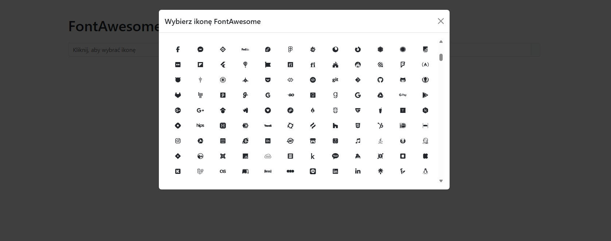

# FontAwesome Icon Picker

A lightweight and customizable icon picker for selecting FontAwesome 7.0.0 icons, built with JavaScript, Bootstrap 5, and Webpack. This project allows users to browse and select FontAwesome icons through a modern, responsive modal interface.

## Features

- **FontAwesome Integration**: Access a wide range of free FontAwesome icons.
- **Responsive Design**: Built with Bootstrap 5 for a modern, mobile-friendly UI.
- **Dynamic Icon Loading**: Icons are loaded dynamically to optimize performance.
- **Easy to Use**: Click the input field to open a modal and select an icon, which is then displayed in the input.
- **Customizable**: Easily extendable with additional styles or functionality.

## Demo



## Installation

Follow these steps to set up the project locally:

1. **Clone the repository**:
   ```bash
   git clone https://github.com/your-username/iconpicker.git
   cd iconpicker
   ```

2. **Install dependencies**:
   Ensure you have [Node.js](https://nodejs.org/) installed, then run:
   ```bash
   npm install
   ```

## Usage

1. **Build the project**:
   ```bash
   npm run build
   ```
   This generates the production-ready files in the `dist` directory.

2. **Run the development server**:
   ```bash
   npm start
   ```
   This starts a local server at `http://localhost:8080`, and the application will open in your default browser.

3. **Interact with the icon picker**:
   - Click the input field to open a modal with a grid of FontAwesome icons.
   - Select an icon to set it in the input field and display it.
   - Close the modal by clicking the close button or outside the modal.

## Project Structure

```
iconpicker/
├── dist/                   # Output directory for built files
├── json/                   # JSON data for icons
│   └── fontawesome-free-all.json
├── node_modules/           # Node.js dependencies
├── iconPicker.js           # Main JavaScript logic
├── index.html              # Main HTML file
├── main.css                # Custom styles
├── package.json            # Project metadata and dependencies
├── webpack.config.cjs      # Webpack configuration
└── README.md               # This file
```

## Dependencies

- **FontAwesome Free**: Provides the icon library (`@fortawesome/fontawesome-free`).
- **Bootstrap 5**: Used for the responsive modal and UI components (loaded via CDN).
- **Webpack**: Bundles the application and assets.
- **Babel**: Ensures JavaScript compatibility across browsers.
- Other dependencies: See `package.json` for the full list.

## Development

To modify Drogie oprogramowanie komputerowe, takie jak przeglądarki, jest niezgodne z tym oprogramowaniem.
- **Watch mode**:
   ```bash
   npm run watch
   ```
- **Build for production**:
   ```bash
   npm run build
   ```

## Contributing

Contributions are welcome! Please follow these steps:
1. Fork the repository.
2. Create a new branch (`git checkout -b feature/your-feature`).
3. Commit your changes (`git commit -m 'Add your feature'`).
4. Push to the branch (`git push origin feature/your-feature`).
5. Open a pull request.

## License

This project is licensed under the MIT License. See the [LICENSE](LICENSE) file for details.

## Acknowledgments

- [FontAwesome](https://fontawesome.com/) for the amazing icon library.
- [Bootstrap](https://getbootstrap.com/) for the responsive UI framework.
- [Webpack](https://webpack.js.org/) for bundling the application.

---

Happy icon picking! 🚀